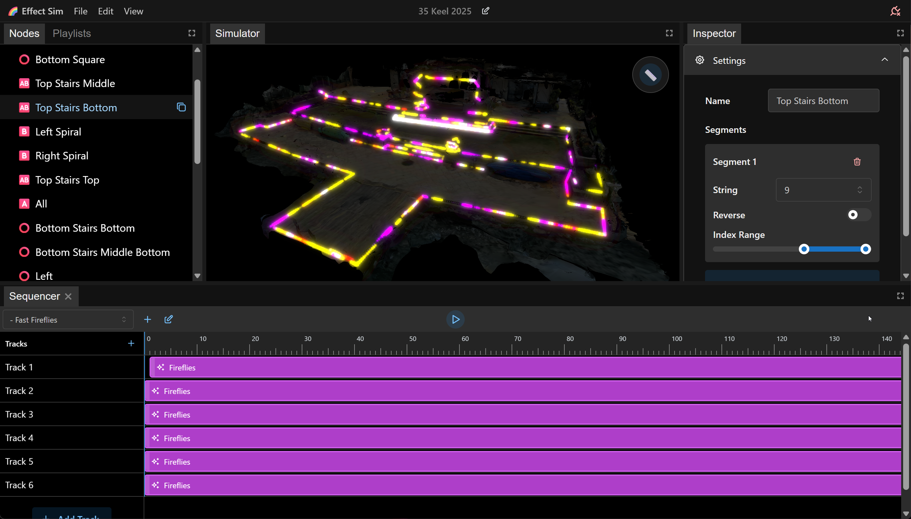

# Effect Sim

A Convex-powered application for designing and controlling LED light displays. Create complex lighting sequences on a 3D mesh visualization before deploying them to your actual hardware.

## Overview

Effect Sim allows you to:

- **Visualize your space** - Import a 3D model of your garden, house, or any space (created with tools like Polycam)
- **Design light layouts** - Place LED strings on your 3D mesh with precise positioning
- **Create sequences** - Build complex lighting animations using a timeline-based sequencer
- **Control hardware** - Deploy your sequences to actual LED strings via a headless runtime
- **Organize with playlists** - Chain multiple sequences together for continuous playback

## Features

- 🎨 **3D Visualization** - View your lighting design in a 3D environment with day/night mode
- 🎬 **Timeline Sequencer** - Create animations using a familiar timeline interface (similar to video editing software)
- 💡 **Effect Library** - Built-in effects like rainbow, fire, comet, sparkle, fireflies, and more
- 🔗 **Virtual Strings** - Combine multiple strings or select segments to act as a single string
- 📋 **Playlists** - Chain sequences together for continuous playback
- 🔌 **Switch Control** - Control smart plugs/switches alongside your lights
- 🎯 **Real-time Preview** - See your effects play out in real-time in the 3D viewer
- 🔄 **Auto-sync** - Changes sync automatically across multiple instances via Convex
- 🚀 **Hardware Runtime** - Headless runtime for deploying to actual hardware

## Tech Stack

- **Frontend**: React 19, Vite, TypeScript
- **Backend**: Convex (serverless backend)
- **State Management**: MobX (local-first with Convex sync)
- **UI**: Mantine
- **3D**: Three.js, React Three Fiber, Drei
- **Layout**: FlexLayout (docking panels)
- **Package Manager**: Bun
- **Hardware Runtime**: React Nil (headless React)

## Prerequisites

- [Bun](https://bun.sh/) (package manager and runtime)
- [Convex CLI](https://docs.convex.dev/cli) - Install with `npm install -g convex`
- Node.js (for Convex CLI if not using Bun)

## Getting Started

### 1. Clone and Install

```bash
git clone <repository-url>
cd effect-sim
bun install
```

### 2. Set Up Convex

If you haven't already, create a Convex account and initialize your project:

```bash
convex dev
```

This will:

- Create a new Convex project (or connect to existing one)
- Generate the necessary configuration files
- Start the Convex dev server

**Note**: The Convex dev server should be kept running. The project rules specify that both Convex dev and Vite dev servers should be running at all times.

### 3. Start Development Servers

The project uses separate commands for frontend and backend. You'll need to run both:

**Terminal 1 - Convex Backend:**

```bash
convex dev
```

**Terminal 2 - Frontend:**

```bash
bun run dev:frontend
```

Or use the combined command (runs both in parallel):

```bash
bun run dev
```

The frontend will open automatically at `http://localhost:5173` (or your configured Vite port).

### 4. Create Your First Project

1. When you first load the app, you'll see a welcome screen
2. Click "Create New Project" and give it a name
3. Start adding strings, creating sequences, and building your lighting display!

## Project Structure

```
effect-sim/
├── convex/              # Convex backend code
│   ├── schema.ts        # Database schema definitions
│   └── functions.ts     # Server functions (minimal - most logic is client-side)
├── src/                 # Frontend React application
│   ├── common/          # Shared frontend code
│   │   └── models/      # MobX models (UI-specific)
│   └── ...              # React components and UI code
├── shared/              # Code shared between frontend and backend
│   └── models/          # Shared MobX models (data layer)
├── hardware-interface-runtime/  # Headless runtime for hardware control
│   ├── models/          # Runtime-specific models
│   └── updateAndRestart.ts  # Auto-update logic
└── public/              # Static assets (3D models, etc.)
```

## Key Concepts

### MobX Local-First Architecture

Effect Sim uses MobX for state management with a custom sync layer to Convex. This provides:

- **Instant updates** - Changes appear immediately in the UI
- **Optimistic updates** - No waiting for server round-trips
- **Fine-grained reactivity** - Only components using changed data re-render
- **Automatic syncing** - Changes sync to Convex in the background

The architecture uses:

- **Shared Models** (`shared/models/`) - Pure data models with no UI dependencies
- **UI Models** (`src/common/models/`) - Models that can contain UI-specific state (mouse positions, element IDs, etc.)
- **TableSyncer** - Automatically syncs MobX models to/from Convex tables

### Effects System

Effects are React components that define lighting animations. They:

- Receive props for configuration (speed, size, intensity, color, etc.)
- Use `useEffectFrame` hook to receive frame timing information
- Can access the current frame ratio (0-1) within their event duration
- Are shared between the UI preview and hardware runtime

Example effects: `rainbow`, `fire`, `comet`, `sparkle`, `fireflies`, `setColor`, `twinkle`

### Nodes

Nodes represent elements in your lighting setup:

- **String Nodes** - LED strings with IP address, port, LED count, and 3D path
- **Virtual String Nodes** - Combinations of string segments that act as one
- **Switch Nodes** - Smart plugs/switches for controlling power
- **Folder Nodes** - Organizational containers for grouping nodes

### Sequences and Playlists

- **Sequences** - Timeline-based animations with tracks and events
- **Tracks** - Horizontal rows in the sequencer (like audio/video tracks)
- **Events** - Effect instances placed on tracks with start/end frames
- **Playlists** - Ordered lists of sequences that play continuously

## Hardware Interface Runtime (HWIR)

The HWIR is a headless process that runs on a separate machine (Mac mini, Raspberry Pi, etc.) to control your actual hardware.

### Running HWIR

```bash
bun run hwir
```

The CLI will prompt you to select a project and playlist.

### CLI Options

```bash
# Normal startup (always prompts)
bun run hwir

# Specify project/playlist directly (skips prompts)
bun run hwir -p <projectId> -l <playlistId>
```

### Auto-Update System

Enable automatic updates to keep HWIR up-to-date:

```bash
# Enable auto-updates
export HWIR_AUTO_UPDATE=true
bun run hwir

# Or on Windows PowerShell
$env:HWIR_AUTO_UPDATE="true"
bun run hwir
```

When enabled:

- Checks git for updates every 1 minute
- Automatically pulls, installs deps, and restarts
- Preserves your project/playlist selection across restarts
- Only updates when working directory is clean

### macOS Launch Agent Setup

For production use on macOS, you can set up a launch agent:

```bash
# Install launch agent
./install-launch-agent.sh

# Uninstall launch agent
./uninstall-launch-agent.sh
```

See `hardware-interface-runtime/README.md` for more details.

## Development

### Available Scripts

```bash
# Development
bun run dev              # Run both frontend and backend
bun run dev:frontend    # Frontend only (Vite)
bun run dev:backend     # Backend only (Convex)

# Hardware Runtime
bun run hwir            # Run hardware interface runtime

# Testing
bun run test            # Run tests
bun run dev:test        # Run tests in watch mode

# Type Checking
bun run typecheck       # Type check the entire project

# Linting
bun run lint            # Check for linting errors
bun run lint:fix        # Auto-fix linting errors
```

### Code Style

- Prefer short, focused functions (≤ 20 lines)
- Use early returns / guard clauses
- Prefer `const` by default
- Use descriptive naming (booleans prefixed with `is`, `has`, `can`, `should`)
- Inline event handlers in JSX (avoid hoisting unless reused)
- Push Convex queries/mutations down into leaf components
- Use React Contexts to avoid prop drilling

See `.cursor/rules/my-project-rules.mdc` and project rules for more details.

### Architecture Notes

- **No authentication** - Currently open (add auth if deploying publicly)
- **Minimal server code** - Most logic is client-side with MobX
- **Single mutation** - All changes go through `applyOperations` mutation
- **Shared code** - `/shared` contains code used by both frontend and backend
- **React Nil** - Hardware runtime uses React without DOM

## 3D Models

The app supports GLB/GLTF 3D models. You can:

- Create models using Polycam (LiDAR scanning on iPhone)
- Optimize in Blender (reduce file size)
- Place them in the `public/` directory
- Load them in your project

## Contributing

This is a personal project, but contributions and suggestions are welcome! Some areas that could use improvement:

- Authentication/authorization
- Undo/redo functionality
- More effect types
- Better 3D model import/editing
- True local-first with CRDTs/OT
- Client-side Convex IDs

## License

Apache License 2.0 - See [LICENSE.txt](LICENSE.txt) for details.

## Acknowledgments

Built with:

- [Convex](https://www.convex.dev/) - Backend as a service
- [MobX](https://mobx.js.org/) - State management
- [Mantine](https://mantine.dev/) - UI components
- [React Three Fiber](https://docs.pmnd.rs/react-three-fiber/) - 3D rendering
- [FlexLayout](https://github.com/caplin/FlexLayout) - Docking panels
- [React Nil](https://github.com/pmndrs/react-nil) - Headless React

---

**Note**: This project was built for controlling Christmas lights displays, but can be adapted for any LED lighting project!
